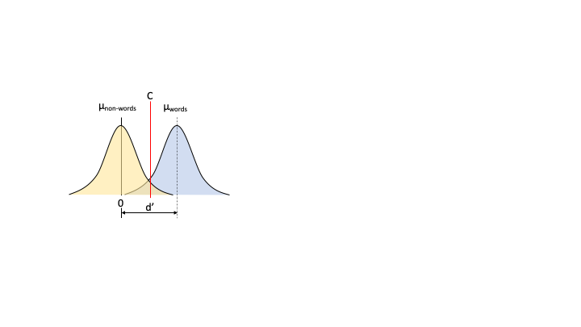

# How to use the PMwG sampler - Signal Detection Theory
```{r, required packages, include=FALSE}
library(tidyverse)
library(knitr)
library(devtools)
```
Here we demonstrate how to use the PMwG sampler package to run a simple signal detection theory (SDT) analysis on a lexical decision task.  We recognise that it is unnecessary to use the sampler package for a simple analysis such as this; however, we hope this example demonstrates the usefulness of the PMwG sampler package.  

Stolen from Wagenmakers paper "This is analogous to a signal detection analysis that allows one to disentangle effects of stimulus discriminability (e.g., d0) from those of criterion placement (i.e., b)."


### Signal Detection Theory analysis of lexical decision task {#sdtOutline}

We assume you have an understanding of SDT so we'll jump to an explanation of how we can use SDT in the context of the lexical decision task.<br>

We begin with the distributions for <i>non-word</i> and <i>word</i> stimuli. You can think of these two distributions as the 'noise' and 'signal' curves, respectively. Each distribution represents the evidence for 'word-likeness' and they are assumed to be normally distributed. The <i>non-word</i> distribution (or the 'noise' distribution) has a mean of 0 and a standard deviation (SD) of 1. We could estimate SD here, but we will use 1 in this example for simplicity. The mean for the <i>word</i> distribution is unknown at this point; however, we assign a d-prime (d') parameter to denote the difference between the mean of the <i>non-word</i> and the mean of the <i>word</i> distributions (i.e. the signal-noise difference between words and non-words). The second parameter we denote is the criterion (C) parameter i.e. the point at which an individual responds <i>non-word</i> (to the left of the criterion (C) in Figure \@ref(fig:sdtImg)) or <i>word</i> (to the right of the criterion (C) in Figure \@ref(fig:sdtImg)). Given these parameters, one would expect that the <i>word</i> distribution would have a higher mean than the non-words, with partial overlap (for words and non-words which might be difficult to classify). The criterion should then be set somewhere between these means. If a person was biased to respond "word", their criterion would move left. In total, in the simple SDT model, there would be 2 parameters - d' (the mean of the word distribution) and C (the criterion). 

<b> Need to add something about means should be positive - to the right of NW mean of 0, otherwise the line about "given these parameters, one would expect that the <i>word</i> distribution would have a higher mean than the non-words, with partial overlap" does not make sense.</b>

```{r simpleSDTImg, echo=FALSE, out.width='100%', fig.show='hold', fig.cap='Simple SDT example of lexical decision task'}

```

### Writing a log-likelihood function

Let's write a simple log likelihood function for a fabricated data set. You can copy the code below to follow along with the example.  
```{r setupllfab}
resp <- c("word", "word", "non-word", "word", "non-word", "non-word", "word", "non-word")
stim <- c("word", "word", "non-word", "word", "non-word", "non-word", "non-word", "word")
fabData <- as.data.frame(cbind(resp, stim))
```
First we create our fabricated dataset by combining a response `resp` and a stimulus `stim` vector into a data frame as shown in \@ref(tab:fakeHead) below.
```{r fakeHead, out.width='80%', fig.asp=.75, fig.align='center', echo=FALSE}
kable(fabData, caption = 'A fabricated dataset of 7 trials with a response and a stimuls column')
```

Our log likelihood function will step through the data, line by line, and find a likelihood value for each trial, under two parameters; d-prime `d` and a criterion `C`. As mentioned [above](#sdtOutline) the <i>non-word</i> distribution has a mean of 0 and SD of 1. This then gives a reference point for where the mean of the <i>word</i> distribution would sit and is denoted by d’.
Now we must find the location of the criterion. Setting the criterion allows us to determine which response will be made i.e. above the criterion, participant will respond <i>word</i> and below the criterion, participant will respond <i>non-word</i>.

Here is our complete log likelihood function. You can copy this function if you'd like to follow along with our example.
```{r sdtLlComplete, attr.source = '.numberLines', eval=FALSE}
SDT_loglike <- function(x, data, sample = FALSE){
  if (sample){
    data$response <- NA
  } else{
    out <- numeric(nrow(data))
    data$out <- NA
  }
  if (!sample){
  for (i in 1:nrow(data)){
    if (stim[i] == "word"){
      if (resp[i] == "word"){
        out[i] <- pnorm(x["C"], mean = x["d"], sd = 1, 
                        log.p = TRUE, lower.tail = FALSE)
      }else{
        out[i] <- pnorm(x["C"], mean = x["d"], sd = 1, 
                        log.p = TRUE, lower.tail = TRUE)
      }
    }else{
      if (resp[i] == "word"){
        out[i] <- pnorm(x["C"], mean = 0, sd = 1, 
                        log.p = TRUE, lower.tail = FALSE)
      }else{
        out[i] <- pnorm(x["C"], mean = 0, sd = 1, 
                        log.p = TRUE, lower.tail = TRUE)
        }
      }
  }
  sum(out)
  }
}
```


We initialise the log likelihood function with three arguments  
```{r llS1, attr.source = '.numberLines', eval=FALSE}
SDT_loglike <- function(x, data, sample = FALSE) {
```
* `x` is a vector of parameter names <b>(Below, x = a vector of two values with parameter names)</b>
* `data` is the dataset
* `sample =` sample values (For this simple example, we do not require a `sample` argument.)

The first if statement (line 2) checks if you want to sample.......... and assigns NAs to your data frames response column. If you're not sampling (like us in this example), you need to create an output vector `out`, that will contain the log likelihood values for each row/trial and assign NAs to the out column of our data frame - why? <b> Need to explain the `(sample)` part below </b>
```{r sdtllL2, attr.source='.numberLines startFrom="2"', eval=FALSE}
  if (sample){
    data$response <- NA
    }else{
      out <- numeric(nrow(data))
      data$out <- NA
      }
```

From line 9, we check each row in the data set, first considering all trials with <i>word</i> stimuli `if (stim[i] == "word"` (line 10), and assign a likelihood for responding <i>word</i> (line 11-12) or <i>non-word</i> (line 13-14). The <i>word</i> distribution has a mean of `x["d"]` (d-prime parameter) and a decision criterion parameter `x["C"]`. If the response is <i>word</i>, we are considering values ABOVE or to the right of the <i>word</i> criterion (<B>C<sub>w</sub></B>) in \@ref(fig:sdtImg), so we set `lower.tail =` to `FALSE`. If the response is <i>non-word</i>, we look for values BELOW or to the left of the <i>word</i> criterion (<B>C<sub>w</sub></B>) in \@ref(fig:sdtImg) and we set `lower.tail =` to `TRUE`. The `log.p =` argument takes the log of all likelihood values when set to `TRUE`. We do this so we can sum all likelihoods at the end of the function. 
<b> Do we need to explain p-norm??</b>
```{r sdtllL8, attr.source='.numberLines startFrom="8"', eval=FALSE}
  if (!sample){
    for (i in 1:nrow(data)){
      if (stim[i] == "word"){
        if (resp[i] == "word"){
          out[i]<- pnorm(x["C"], mean = x["d"], sd = 1, 
                         log.p = TRUE, lower.tail = FALSE)
    }else{
      out[i]<- pnorm(x["C"], mean = x["d"], sd = 1, 
                     log.p = TRUE, lower.tail = TRUE)
      }
```

<b>Include a modified version of SDT illustration?</b>
 
From line 16 (`}else{` i.e. `stim[i] == "non-word"`), we have the function for <i>non-word</i> trials. As can be seen below, the output value `out[i]` for these trials is arrived at in a similar manner to the <i>word</i> trials. We set the `mean` to 0 and the standard deviation (`sd`) to 1. If the response is <i>word</i>, we are considering values ABOVE or to the right of the <i>non-word</i> criterion (<B>C<sub>nw</sub></B>) in \@ref(fig:sdtImg), so we set `lower.tail =` to `FALSE`. If the response is <i>non-word</i>, we look for values BELOW or to the left of the <i>non-word</i> criterion (<B>C<sub>nw</sub></B>) in \@ref(fig:sdtImg) and we set `lower.tail =` to `TRUE`. Again we want the log of all likelihood values so `log.p = TRUE`.

```{r part4.3, attr.source='.numberLines startFrom="17"', eval=FALSE} 
    }else{
      if (resp[i] == "word"){
        out[i] <- pnorm(x["C"], mean = 0, sd = 1, 
                        log.p = TRUE, lower.tail = FALSE)
        }else{
          out[i]<- pnorm(x["C"], mean = 0, sd = 1, 
                         log.p = TRUE, lower.tail = TRUE)
        }
      }
```

The final line of code on line 24 sums the `out` vector and returns a log-likelihood value for your model.
<b> The text alignment/justification for code blocks is determined by the length of the longest line in the code block</b>
```{r part4.4,eval=FALSE}
sum(out)
```

## Testing the SDT log likelihood function

Before we run the log likelihood function, we must create a parameter vector `pars` containing the same parameter names used in our log likelihood function above i.e. we name the criterion `C` and d-prime parameter `d` and we assign arbitrary values to each parameter. 
<b> Can this code be improved/shortened?</b>
```{r, setupPars}
pars <- c(0.8, 2)
names(pars) <- c("C", "d")
```

We can test run our log likelihood function by passing in the parameter values `pars` and the fabricated dataset we created above `fabData`. 

```{r simple-SDT, include=FALSE}
SDT_loglike <- function(x, data, sample = FALSE){
  if (sample){
    data$response <- NA
  } else{
    out <- numeric(nrow(data))
    data$out <- NA
  }
  if (!sample){
  for (i in 1:nrow(data)){
    if (stim[i] == "word"){
      if (resp[i] == "word"){
        out[i] <- pnorm(x["C"], mean = x["d"], sd = 1, 
                        log.p = TRUE, lower.tail = FALSE)
      }else{
        out[i] <- pnorm(x["C"], mean = x["d"], sd = 1, 
                        log.p = TRUE, lower.tail = TRUE)
      }
    }else{
      if (resp[i] == "word"){
        out[i] <- pnorm(x["C"], mean = 0, sd = 1, 
                        log.p = TRUE, lower.tail = FALSE)
      }else{
        out[i] <- pnorm(x["C"], mean = 0, sd = 1, 
                        log.p = TRUE, lower.tail = TRUE)
        }
      }
  }
  sum(out)
  }
}
```

```{r part5}
SDT_loglike(pars, fabData)
```
Now, if we change the parameter values, the log-likelihood value should also change.
```{r part6}
pars <- replace(pars, c(1,2), c(0.5, 1.2))
SDT_loglike(pars, fabData)
```
We can see the log likelihood has changed, so these values are more accurate given the data. 
<b> This is vague. What's the point of this? Seems insufficient to look for a change in the LL</b>

## SDT log likelihood function for Wagenmakers experiment

Now that we've covered a simple test example, lets create a log likelihood function the @wagenmakers2008diffusion dataset.

### Description of Wagenmakers experiment

Participants were asked to indicate whether a letter string was a <i>word</i> or a <i>non-word</i>.  A subset of Wagenmaker et al data are shown in table \@ref(tab:wagenmakers10), with each line representing a single trial. We have a `subject` column with a subject id (1-19), a condition column `cond` which indicates the proportion of <i>words</i> to <i>non-words</i> presented within a block of trials. In word blocks (`cond = w`) participants completed 75% word and 25% non-word trials and for non-word (`cond = nw`) blocks 75% non-word and 25% word trials. The `stim` column lists the word's frequency i.e. is the stimulus a <i>very low frequency</i> word (`cond = vlf`), a <i>low frequency</i> word (`cond = lf`) or a <i>high frequency</i> word (`cond = hf`). The third column `resp` refers to the participant's response i.e. the participant responded <i>word</i> (`resp = W`) or <i>non-word</i> (`resp = NW`). The two remaining columns list the response time (`rt`) and whether the paricipant made a correct (`correct = 2`) or incorrect (`correct = 1`) choice. 

For more details about the experiment please see [the original paper](https://www.sciencedirect.com/science/article/pii/S0749596X07000496).  <b> Is this the correct paper to reference? </b>

```{r setupWagen, include=FALSE}
load("wagenmakers_2008.RData")
wagenmakers2008 <- data
```

```{r wagenmakers10, echo=FALSE, out.width='80%', fig.asp=.75, fig.align='center'}
kable(slice(wagenmakers2008, 91:102), row.names = FALSE, caption = 'Subset of 10 trials from the Wagenmakers (2008) dataset.')
```
Our log-likelihood function for Wagenmakers experimental data is similar to the function we wrote above, except now we need to include  


```{r sdtImg, echo=FALSE, out.width='100%', fig.show='hold', fig.cap='Signal detection theory example of lexical decision task'}
knitr::include_graphics('sdt.png')
```

Again, we first specify the function with x, data and sample = FALSE

```{r part7.1, eval=FALSE}
SDT_loglike_slow = function(x,data,sample=FALSE){
```

 (d'<sub>hf</sub>, d'<sub>lf</sub>, d'<sub>vlf</sub>)


\@ref(fig:sdtPlot)
```{r SDTplotsetup, eval=TRUE, include=FALSE}
library("tidyverse")
library("reshape2")
# Samplers project - SDT example
parEst <- c(C.w = 0.9269677, C.nw = 1.7675702, HF.d = 2.9327993, LF.d = 2.6904818, VLF.d = 2.1823751)
# estimate curve for non-words
nwD <- round(rnorm(n = 5000, mean = 0,sd = 1), 2)
# estimate curve for high frequency words
hfwD <- round(rnorm(n = 5000, mean = parEst[3], sd = 1), 2)
# estimate curve for low frequency words
lfwD <- round(rnorm(n = 5000, mean = parEst[4], sd = 1), 2)
# estimate curve for very low frequency words
vlfwD <- round(rnorm(n = 5000, mean = parEst[5], sd = 1), 2)
# combine into data frame
dfff <- bind_cols(hf = hfwD, lf = lfwD, nw = nwD, vlf = vlfwD)
dfff <- melt(dfff)
```
```{r sdtPlot, echo=FALSE, fig.cap="sdt posterior"}
# plot distributions with non-word criterion (red line) and word criterion (blue line)
ggplot(dfff,aes(x=value, fill=variable)) + 
  geom_density(alpha=0.25) + 
  geom_vline(xintercept = parEst[1], colour = 'blue') + 
  geom_vline(xintercept = parEst[2], colour = 'red') + 
  scale_y_continuous(limits = c(0, 0.42), expand = expand_scale(mult = c(0, .1)))
```

<b>A second example might cover another SDT example with the addition of trial level covariate i.e. analytic solution NA.</b>
