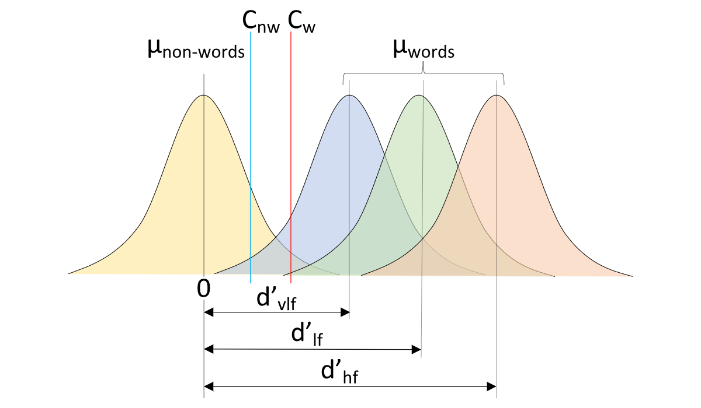

# How to use the PMwG sampler - Signal Detection Theory

Here we demonstrate how to use the PMwG sampler package to run a simple signal detection theory (SDT) analysis on a lexical decision task taken from @wagenmakers2008diffusion.  We recognise that it is unnecessary to use the sampler package for a simple analysis such as this; however, we hope this example demonstrates the usefulness of the samplers package.  

Stolen from Wagenmakers paper "This is analogous to a signal detection analysis that allows one to disentangle effects of stimulus discriminability (e.g., d0) from those of criterion placement (i.e., b)."


## Description of Wagenmakers experiment

Participants were asked to indicate whether a letter string was a <i>word</i> or a <i>non-word</i>.  A subset of Wagenmaker et al data are shown in table \@ref(tab:wagenmakers10). We have a `subject` column with a subject id (1-19), a condition column `cond` which indicates the proportion of <i>words</i> to <i>non-words</i> presented within a block of trials. In word blocks (`cond = w`) participants completed 75% word and 25% non-word trials and for non-word (`cond = nw`) blocks 75% non-word and 25% word trials. The `stim` column lists the word's frequency i.e. is the stimulus a <i>very low frequency</i> word (`cond = vlf`), a <i>low frequency</i> word (`cond = lf`) or a <i>high frequency</i> word (`cond = hf`). The third column `resp` refers to the participant's response i.e. the participant responded <i>word</i> (`resp = W`) or <i>non-word</i> (`resp = NW`). The two remaining columns list the response time (`rt`) and whether the paricipant made a correct (`correct = 2`) or incorrect (`correct = 1`) choice. 

For more details about the experiment please see [the original paper](https://www.sciencedirect.com/science/article/pii/S0749596X07000496).  <b> Is this the correct paper to reference? </b>

```{r setupWagen, include=FALSE}
load("wagenmakers_2008.RData")
wagenmakers2008<-data
```

```{r wagenmakers10, echo=FALSE, out.width='80%', fig.asp=.75, fig.align='center'}
kable(slice(wagenmakers2008, 91:102), row.names = FALSE, caption = 'Subset of 10 trials from the Wagenmakers (2008) dataset.')
```

### Signal Detection Theory

We assume you have an understanding of SDT so we'll jump to an explanation of how we can use SDT in the context of the lexical decision task. 
We begin with the distributions for <i>non-word</i> and <i>word</i> stimuli. You can think of these two distributions as the 'noise' and 'signal' curves, respectively. Each distribution represents the evidence for 'word-likeness' and they are assumed to be normally distributed. The <i>non-word</i> distribution (or the 'noise' distribution) has a mean of 0 and a standard deviation (SD) of 1 (Note: we could estimate SD here, but we will use 1 in this example for simplicity). The mean for each <i>word</i> distribution is unknown at this point, however, we assign a d-prime parameter (i.e. the signal-noise difference between words and non-words) to each distribution (d'<sub>hf</sub>, d'<sub>lf</sub>, d'<sub>vlf</sub>). The second parameter we denote is the criterion (C) parameter i.e. the point at which an individual responds <i>non-word</i> (to the left of the Cs in Figure \@ref(fig:sdtImg)) or <i>word</i> (to the right of the Cs in Figure \@ref(fig:sdtImg)). Given these parameters, one would expect that the <i>word</i> distributions would have a higher mean than the non-words, with some partial overlap (for words and non-words which might be difficult to classify). The criterion should then be set somewhere between these means. If a person was biased to respond "word", they're criterion would move left. In total, in the simple SDT model, there would be 2 parameters - d' (the mean of the word distribution) and C (the criterion).

```{r sdtImg, echo=FALSE, out.width='100%', fig.show='hold', fig.cap='Signal detection theory example of lexical decision task'}

```

\@ref(fig:sdtPlot)
```{r SDTplotsetup, eval=TRUE, include=FALSE}
library("tidyverse")
library("reshape2")
# Samplers project - SDT example
parEst <- c(C.w = 0.9269677, C.nw = 1.7675702, HF.d = 2.9327993, LF.d = 2.6904818, VLF.d = 2.1823751)
# estimate curve for non-words
nwD <- round(rnorm(n = 5000, mean = 0,sd = 1), 2)
# estimate curve for high frequency words
hfwD <- round(rnorm(n = 5000, mean = parEst[3], sd = 1), 2)
# estimate curve for low frequency words
lfwD <- round(rnorm(n = 5000, mean = parEst[4], sd = 1), 2)
# estimate curve for very low frequency words
vlfwD <- round(rnorm(n = 5000, mean = parEst[5], sd = 1), 2)
# combine into data frame
dfff <- bind_cols(hf = hfwD, lf = lfwD, nw = nwD, vlf = vlfwD)
dfff <- melt(dfff)
```
```{r sdtPlot, echo=FALSE, fig.cap="sdt posterior"}
# plot distributions with non-word criterion (red line) and word criterion (blue line)
ggplot(dfff,aes(x=value, fill=variable)) + 
  geom_density(alpha=0.25) + 
  geom_vline(xintercept = parEst[1], colour = 'blue') + 
  geom_vline(xintercept = parEst[2], colour = 'red') + 
  scale_y_continuous(limits = c(0, 0.42), expand = expand_scale(mult = c(0, .1)))
```

<b>A second example might cover another SDT example with the addition of trial level covariate i.e. analytic solution NA.</b>
